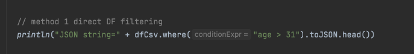
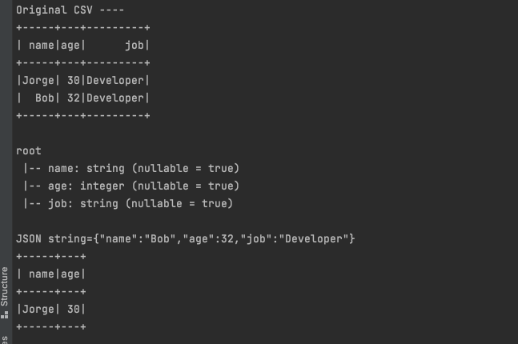

# What is this
This is a sample program to demo using one line of 
code to generate JSON output.

The code uses Spark to auto-infer data types. 

# Benefits
Please the Medium article:
[Schema-free web services](https://medium.com/@bicode_47996/schema-free-web-services-a273ec633878)

# Run Command
`sbt run`

## Code Line

## Output
